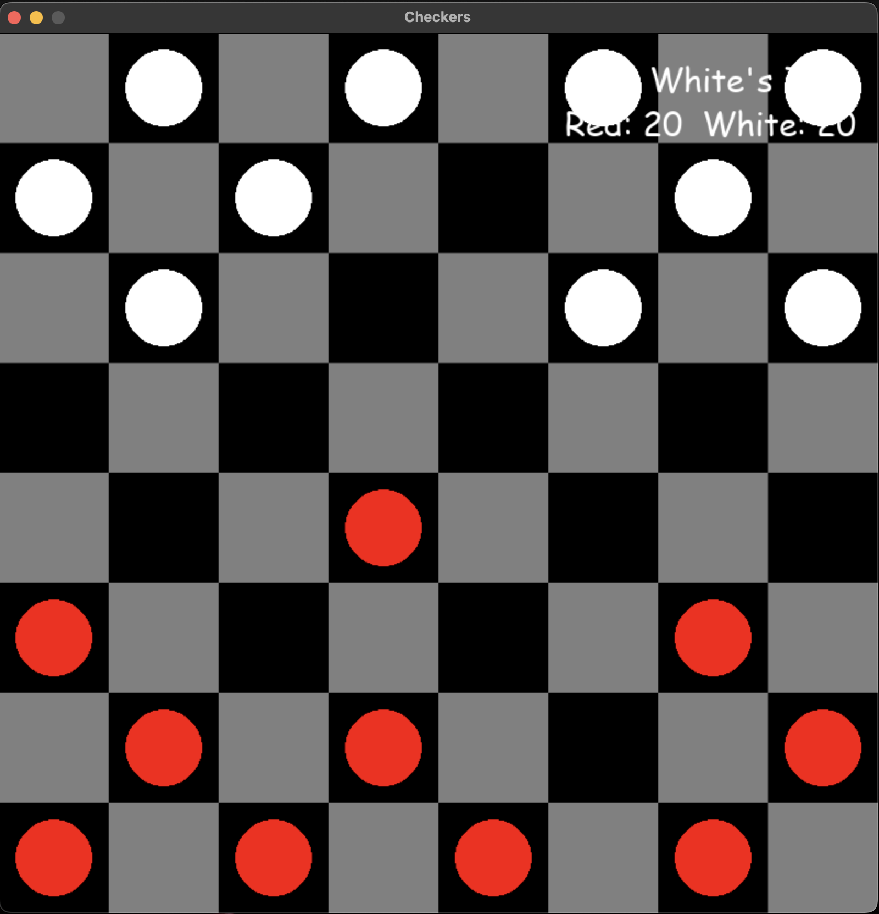
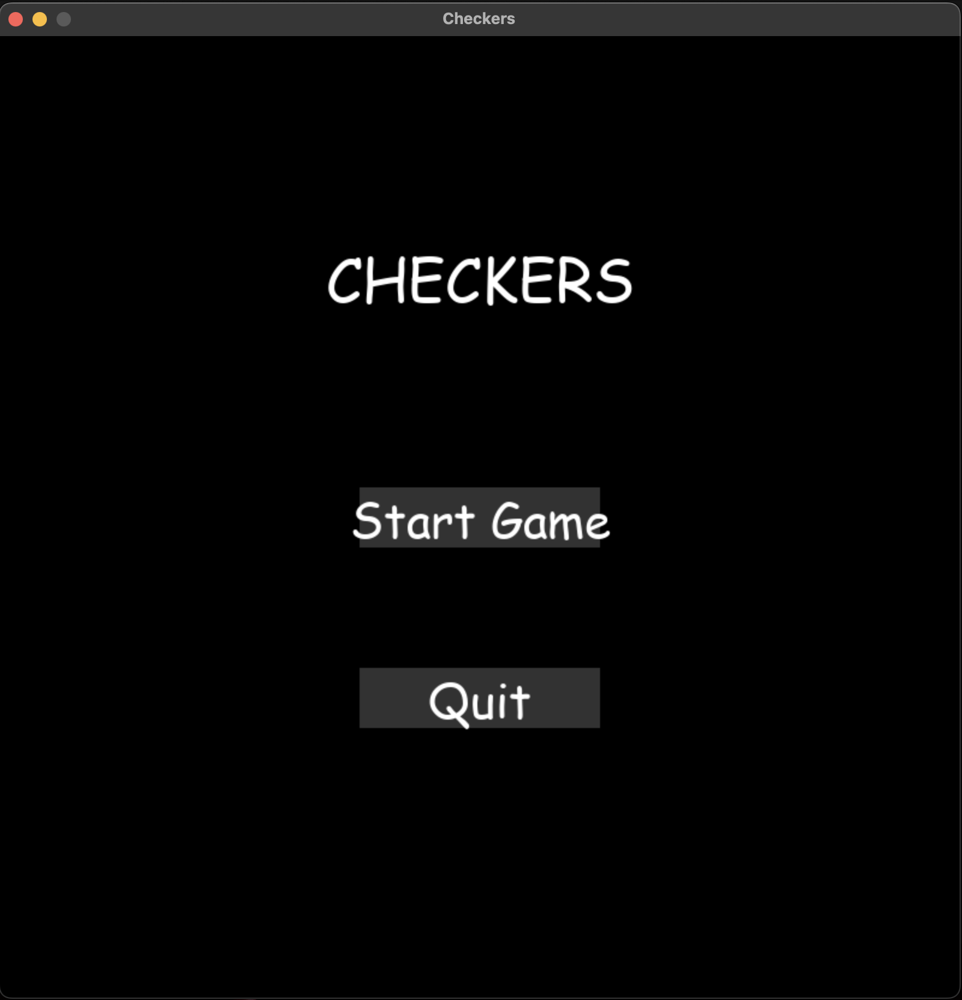

# Checkers Game

A classic checkers game implemented in Python using Pygame. This implementation features:

- Two-player gameplay (Red vs White)
- Standard checkers rules and movement
- King piece promotion
- Multiple jumps/captures
- Scoring system
- Interactive UI with menus and buttons
- Turn indicators and score display

## Features
- **Main Menu**: Start game or quit
- **Game Screen**: Interactive board with piece selection and move highlighting
- **Game Over Screen**: Displays winner and options to play again or quit
- **Scoring System**: Points for captures, king promotions, and winning

## Screenshots

*Main menu screen with Start Game and Quit buttons*

*Game in progress showing board, pieces, and score display*

## Requirements
- Python 3.x
- Pygame

## Installation
1. Clone the repository
2. Install dependencies: `pip install -r requirements.txt`
3. Run the game: `python checkers.py`

## Controls
- **Mouse**: Select pieces and make moves
- **Menu Navigation**: Click buttons to start, restart, or quit

Enjoy this classic game with modern features and smooth gameplay! 